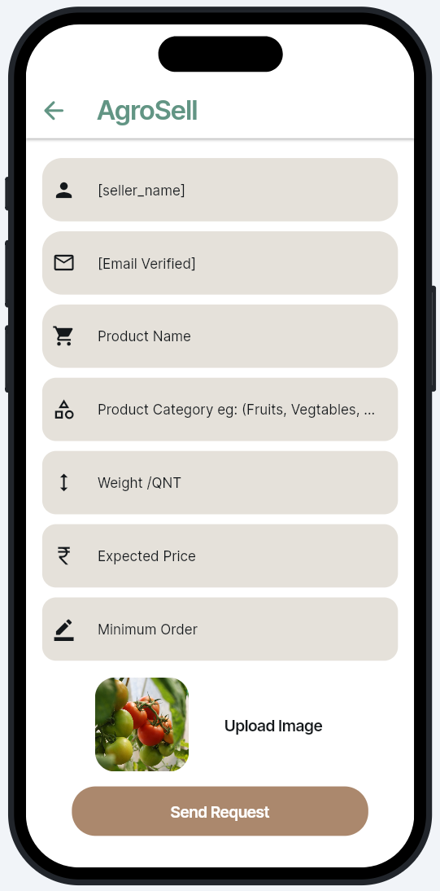
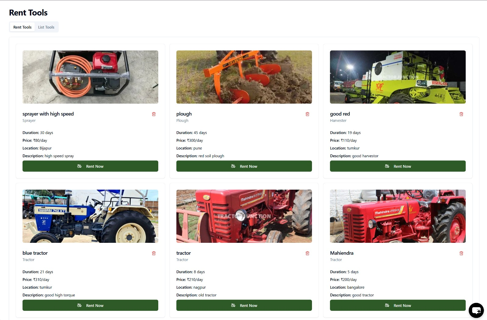

# AgroTrack: One App for All Your Farming Needs

## Table of Contents
- [Project Overview](#project-overview)
- [Components Used](#components-used)
- [Working Environment](#working-environment)
- [Application Architecture](#application-architecture)
- [Key Features](#key-features)
- [Results](#results)
  - [Mobile Application](#mobile-application)
  - [Web Interface](#web-interface)
- [Conclusion](#conclusion)

## Project Overview
AgroTrack is an all-in-one farm management solution designed to streamline the operations of modern farmers. This system supports crop monitoring, irrigation alerts, market tracking, and more through a feature-rich Android mobile application and a responsive web dashboard. AgroTrack empowers users with real-time insights and smart automation for improved decision-making and productivity.

## Components Used
- Android Studio: For native Android app development.
- Firebase Authentication: Secure user login and signup.
- Firebase Firestore: Cloud-based NoSQL database for storing user data.
- Firebase Cloud Messaging: Push notifications and alerts.
- Firebase Storage: Media and file storage for farm data.
- HTML, CSS, JavaScript: For developing the responsive web dashboard.
- Material Design / Tailwind CSS: For clean and user-friendly interfaces.

## Working Environment
- IDEs: Android Studio and Visual Studio Code
- Database: Firebase Firestore
- Hosting: Firebase Hosting / GitHub Pages (for web)
- Testing: Android Emulator, Chrome DevTools, Physical Android Devices

## Application Architecture
The AgroTrack system adopts a modular architecture to ensure high scalability and maintainability:
- Model-View-ViewModel (MVVM) pattern for the Android application.
- Modular and component-based structure for the web application.
- Repository Pattern to separate data access and logic layers.
- Real-time database sync via Firebase for all user actions.

## Key Features
- User Authentication: Login and registration using Firebase Authentication.
- Crop Monitoring: Track the health and growth status of crops.
- Smart Irrigation: Alerts based on environmental data or manual input.
- Market Price Tracking: Stay updated with local mandi rates.
- Farm Dashboard: Overview of farm metrics, logs, and recent activity.
- Geo-Location Tagging: Save and view specific farm plots using maps.
- Cloud Backup: Store all farm data securely on the cloud.
- Media Upload: Upload images and documents relevant to crop status.

## Results

### Mobile Application

The following screenshots demonstrate the user interface and features of the AgroTrack Android application:

  
  
  
  
  
  
  
  

### Web Interface

The following screenshots highlight the AgroTrack web dashboard:

  
  
  
  
  

## Conclusion
AgroTrack is a robust, scalable, and efficient solution for modern agriculture. By integrating real-time data services, cloud storage, and cross-platform accessibility, the system ensures that farmers can manage their activities effortlessly from anywhere. It serves as a strong foundation for smart farming and future integration with IoT-based automation tools.

