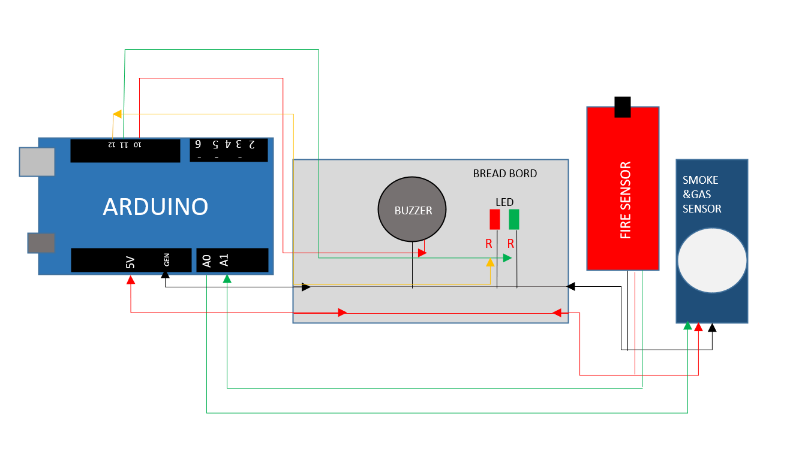
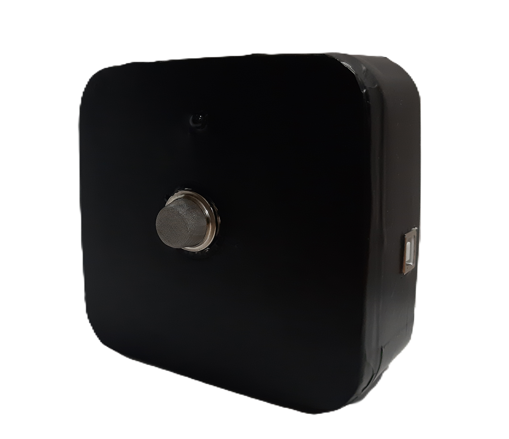

# Fire & Smoke, Gas Detector with Alarm System

## Project Overview
This project aims to develop a cost-effective fire alarm system using Arduino Uno and various sensors to detect smoke, fire, and gas hazards. The system triggers alarms and alerts in case of detected dangers, helping to prevent potential fire incidents in residential and commercial settings.

## Components Used
- **MQ2 Gas Sensor:** Detects gases such as LPG, propane, methane, smoke, and carbon monoxide.
- **Flame Sensor:** Detects infrared light emitted by flames.
- **Arduino Uno:** Microcontroller board for processing sensor data and controlling alarms.
- **Buzzer:** Produces audible alerts.
- **LEDs:** Visual indicators of alarm status.

## Working Environment
- **IDE:** Arduino IDE, used for programming the Arduino Uno.
- **Simulation:** Tinkercad was used for circuit simulation and design.

## Circuit Connection

This diagram illustrates how the components are connected to the Arduino Uno and to each other to form the fire and smoke, gas detector system.

## Final Project

This image shows the final prototype of the fire and smoke, gas detector with alarm system.

## Conclusion
The fire and smoke, gas detector system developed here provides an effective solution for early detection of fire, smoke, and gas hazards, leveraging Arduino-based technology and affordable sensors. It demonstrates reliable performance in detecting potential hazards, thereby enhancing safety and reducing risks in various environments.
