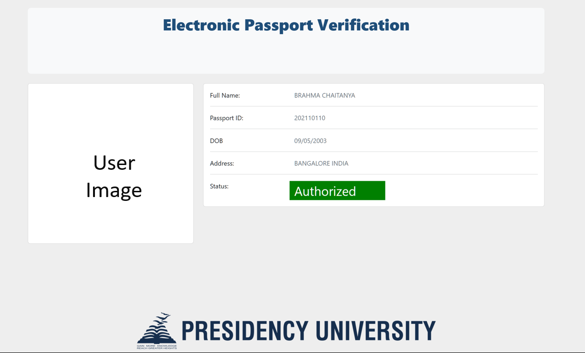
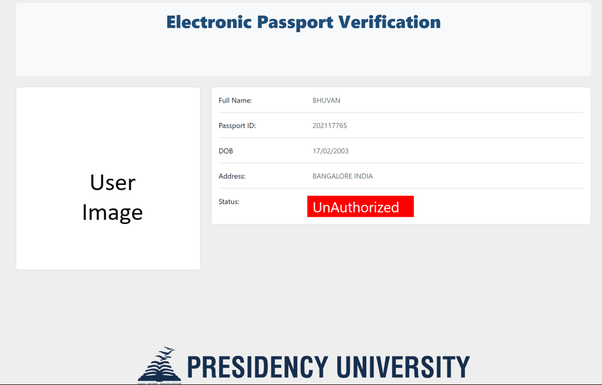

# QR-CODE and IoT Based Electronic Passport Verification with Alert System

Welcome to the **Electronic Passport Verification** project! This document provides a comprehensive overview of the project, detailing its purpose, hardware and software requirements, working process, and more.

## Table of Contents

- [About the Project](#about-the-project)
- [Hardware Requirements](#hardware-requirements)
- [Software Requirements](#software-requirements)
- [Working Process](#working-process)
- [User Interface](#user-interface)
- [Conclusion](#conclusion)

## About the Project

This project aims to create an efficient and secure system for verifying electronic passports using a Raspberry Pi Pico. The system utilizes QR code technology to facilitate quick and reliable border crossing processes. By integrating IoT capabilities, the system provides real-time tracking and verification of a passport holder's identity. This project ensures enhanced security and smooth operation at border control points.

**Key Features:**

- Easy and efficient verification of electronic passports.
- Real-time data retrieval and authentication.
- Integration with IoT platforms for seamless operation.
- User-friendly interface with clear status indicators.

## Hardware Requirements

To set up the electronic passport verification system, the following hardware components are required:

1. **Raspberry Pi Pico**: A microcontroller board featuring the RP2040 chip, ideal for controlling the verification system.
2. **LCD Display**: An LCD screen compatible with the Hitachi HD44780 driver for displaying user information and system status.
   - [Example Display](https://www.adafruit.com/product/399)
3. **ESP8266 Wi-Fi Module**: A module to provide Wi-Fi connectivity for the system, enabling data transmission and communication.
   - [Example Module](https://www.adafruit.com/product/2282)
4. **OV2640 Camera Module 2MP**: A camera module for capturing and reading QR codes.
   - [Example Camera Module](https://www.adafruit.com/product/397)
5. **Buzzer**: A buzzer module to provide auditory feedback for verification status.
   - [Example Buzzer](https://www.adafruit.com/product/160)

## Software Requirements

1. **Arduino IDE**: For programming the Raspberry Pi Pico.
   - [Download Arduino IDE](https://www.arduino.cc/en/software)
2. **Blynk Library**: To connect the project to the Blynk platform for data retrieval and system control.
   - [Blynk Library Installation](https://www.blynk.cc/)
3. **Python**: For additional scripting and data handling, if required.
   - [Download Python](https://www.python.org/downloads/)

## Working Process

The electronic passport verification system operates as follows:

1. **QR Code Scanning**: Upon arrival at a border crossing, the passport holder presents their e-passport to a border control officer.
2. **Data Retrieval**: The officer scans the QR code using a handheld device connected to the Raspberry Pi Pico. The device retrieves the biometric and personal data stored on the e-passport's microprocessor chip.
3. **Verification**: The system connects to the Blynk platform to fetch additional data and verify the passport holder's identity.
4. **Status Display**: The user's information and verification status are displayed on the LCD screen. An authorized user will see a green status, while an unauthorized user will see a red status.

## User Interface

The user interface is designed to be clear and straightforward, displaying key information and status updates. 

- **Authorized User**: When the passport holder's identity is verified, their profile will be displayed with a green status indicating successful verification.
  

- **Unauthorized User**: If the verification fails, the profile will show a red status indicating unauthorized access.

## Conclusion

The electronic passport verification system using a Raspberry Pi Pico offers a modern solution for border control and identity verification. It enhances security by ensuring that only authorized individuals are granted access, and its integration with IoT platforms allows for seamless and efficient operation.

**Key Benefits:**

- Improved security and authenticity in passport verification.
- Streamlined process for border control, reducing wait times.
- User-friendly interface with clear feedback on verification status.

---

Thank you for using the electronic passport verification system. We look forward to enhancing the security and efficiency of your border control processes.
