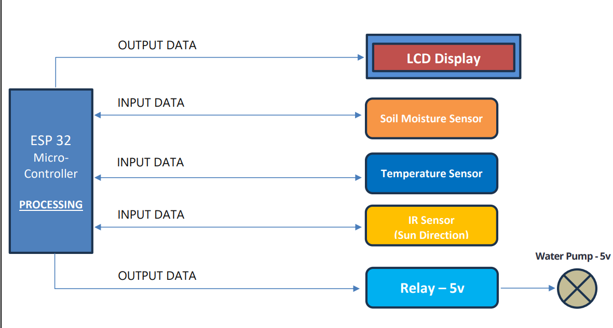
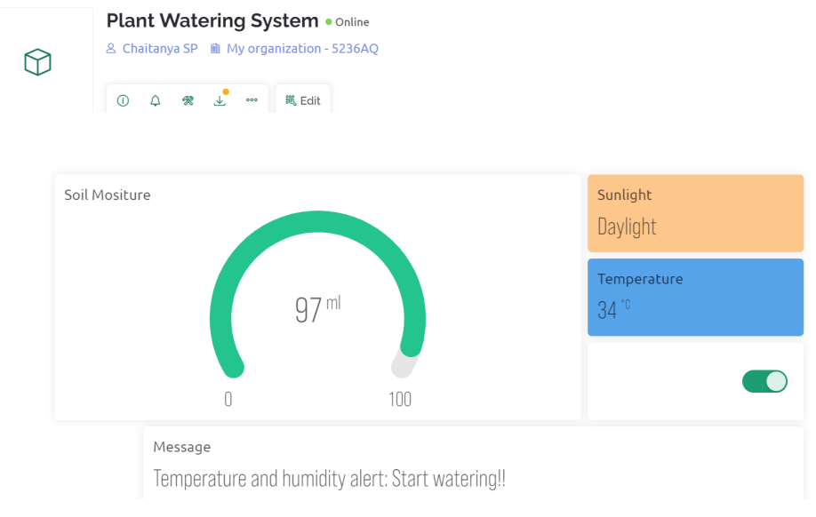
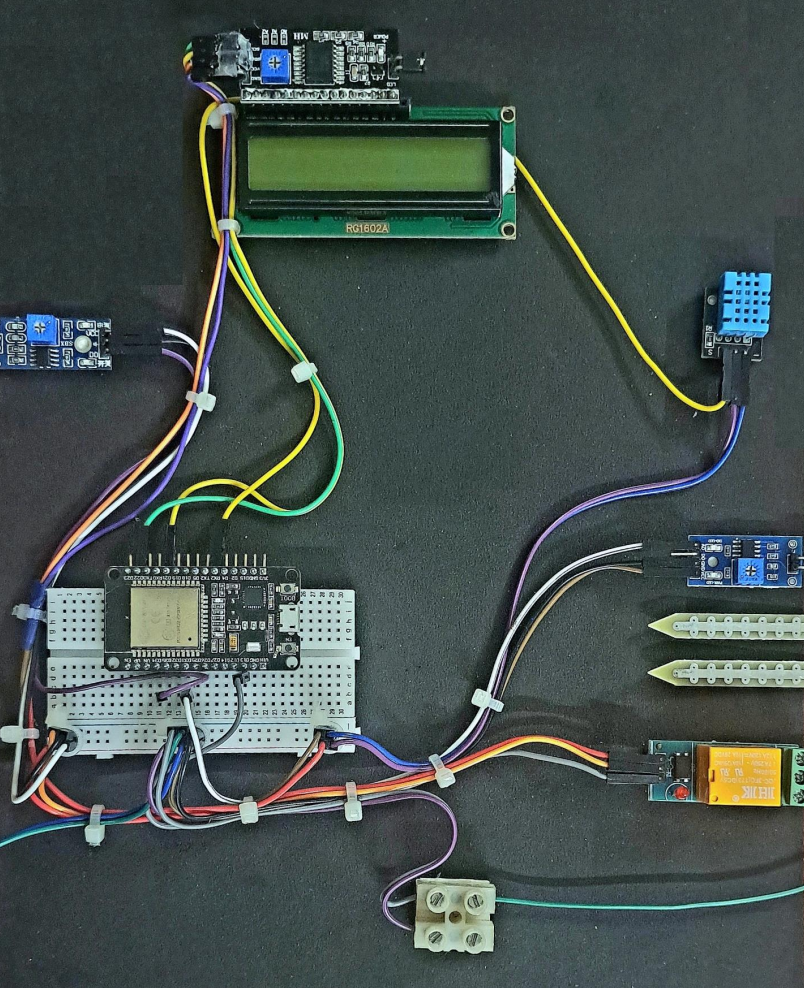

# Smart Irrigation: Automating Field Watering

## Table of Contents

- [About the Project](#about-the-project)
- [Hardware Requirements](#hardware-requirements)
- [Software Requirements](#software-requirements)
- [Working Process](#working-process)
- [User Interface](#user-interface)
- [Final Prototype](#final-prototype)
- [Conclusion](#conclusion)

## About the Project

Smart Irrigation: Automating Field Watering addresses the inefficiencies of traditional irrigation methods by implementing an automated system. Leveraging sensor technologies, including soil moisture sensors, humidity sensors, temperature sensors, light intensity sensors, and IR fire sensors, the project monitors key environmental factors crucial for plant growth and field safety. By analyzing real-time data, the system optimizes irrigation schedules to ensure crops receive appropriate water levels at the right times, while also detecting and responding to changes in sunlight intensity. This automated approach not only conserves water resources but also enhances crop yield and quality by creating ideal growing conditions. Moreover, by reducing the reliance on chemical fertilizers and pesticides, the project promotes environmental sustainability. The system also introduces advanced features such as real-time notifications and remote access via the Blynk cloud platform, significantly advancing beyond previous irrigation control methods. Overall, Smart Irrigation represents a significant advancement in agricultural technology, offering a sustainable and efficient solution to modern farming challenges.

## Hardware Requirements

The hardware requirements for the Smart Irrigation system include:

- Microcontroller (e.g., ESP32)
- Soil moisture sensors
- Temperature sensors
- Humidity sensors
- Light intensity sensors
- IR fire sensors
- Water pump motor
- Relay module
- LCD display (optional, for local display)
- Power supply components (e.g., batteries, solar panels)

These components are essential for monitoring environmental conditions, controlling irrigation processes, and ensuring reliable operation of the system.

## Software Requirements

The software requirements for the Smart Irrigation system encompass:

- Firmware development for the microcontroller (using C/C++ and platforms like Arduino IDE or ESP-IDF)
- Integration with the Blynk cloud platform for remote monitoring and control
- Data processing and analysis algorithms for optimizing irrigation schedules
- User interface design for local or remote access (via Blynk app or web dashboard)

These software components enable real-time data collection, analysis, and responsive control of the irrigation system, enhancing efficiency and usability.

## Working Process

The Smart Irrigation system operates through the following process:

1. **Sensor Data Acquisition:** Soil moisture, temperature, humidity, light intensity, and IR fire sensors collect environmental data.
   
2. **Data Analysis:** The microcontroller analyzes sensor data to determine optimal irrigation schedules and fire detection based on sunlight intensity.

3. **Irrigation Control:** The system activates the water pump motor via the relay module to irrigate fields according to predefined schedules and environmental conditions.

4. **Remote Monitoring and Control:** Users can monitor and control the irrigation system remotely using the Blynk app or web dashboard, receiving real-time notifications and adjusting settings as needed.

5. **Feedback and Optimization:** Continuous monitoring and feedback enable system optimization for improved water efficiency, crop yield, and environmental sustainability.

## User Interface

The user interface for the Smart Irrigation system includes:

- **Blynk Mobile App:** Provides real-time data visualization, control options, and notifications.
- **Web Dashboard:** Offers a comprehensive view of system status, sensor readings, and historical data.
- **Local Interface (optional):** LCD display for on-site monitoring and manual control.

These interfaces facilitate intuitive interaction with the Smart Irrigation system, empowering users to make informed decisions and optimize agricultural practices.

## Final Prototype

### Prototype Overview

The final prototype of the Smart Irrigation system demonstrates the integration of hardware and software components to achieve automated field watering. It consists of:

- **Microcontroller Unit:** Controls sensor data acquisition, data processing, and irrigation scheduling.
- **Sensor Array:** Monitors soil moisture, temperature, humidity, light intensity, and IR fire occurrences.
- **Water Pump Motor:** Activates based on environmental conditions and user-defined settings.
- **Remote Access Interface:** Enables real-time monitoring and control via the Blynk app or web dashboard.

### Prototype Image

This prototype showcases the functionality and design principles of the Smart Irrigation system, serving as a testbed for further development and refinement.

## Conclusion

Smart Irrigation: Automating Field Watering represents a transformative approach to agricultural irrigation, integrating advanced sensor technologies, real-time data analytics, and remote access capabilities. By optimizing water usage, enhancing crop yield, and promoting environmental sustainability, the system addresses key challenges facing modern farming practices. Through continuous innovation and integration of user feedback, Smart Irrigation offers a scalable and efficient solution to support global agricultural sustainability efforts.
