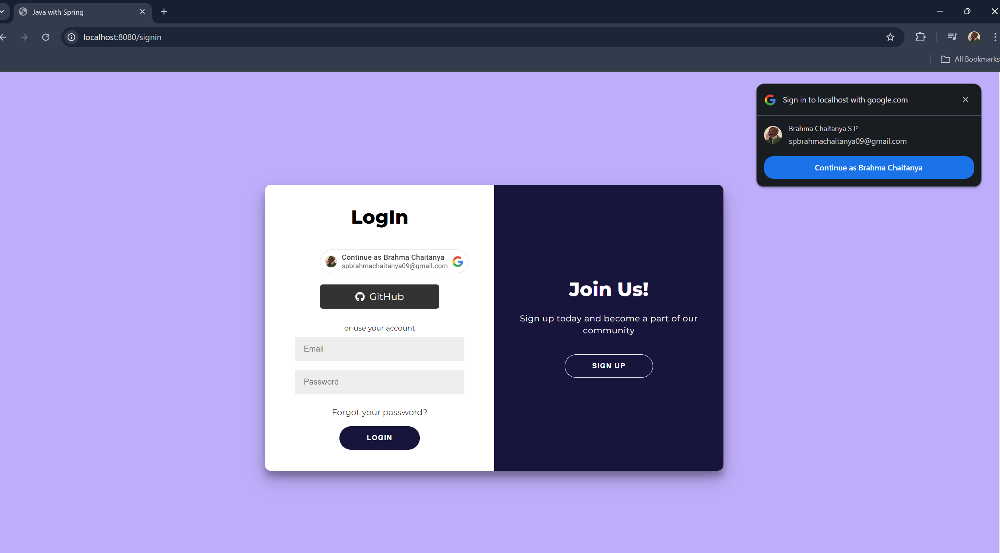
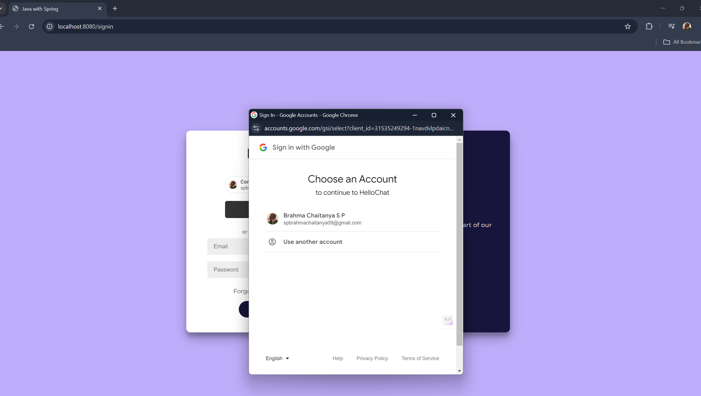
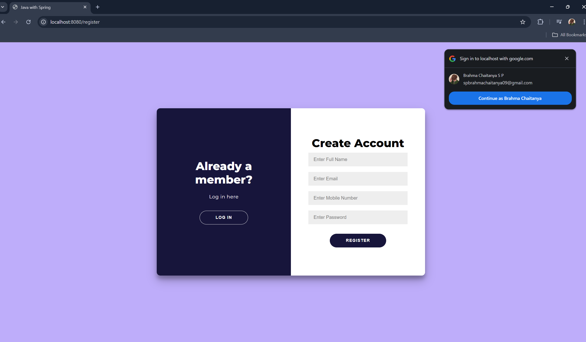
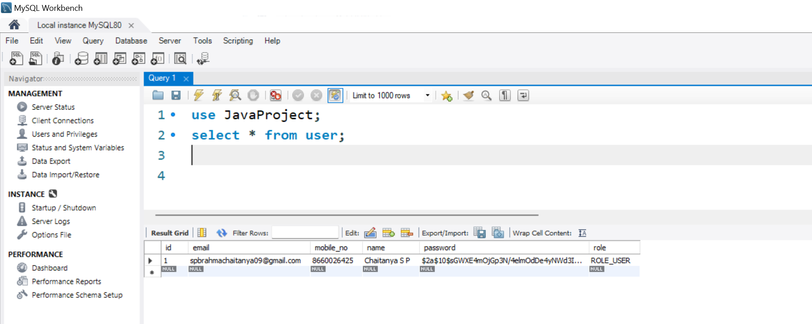

# Spring Security in Java Web Application: Encrypted Authentication & OAuth Support

## Table of Contents
- [Project Overview](#project-overview)
- [Components Used](#components-used)
- [Working Environment](#working-environment)
- [Application Architecture](#application-architecture)
- [Key Features](#key-features)
- [Screenshots](#screenshots)
- [Conclusion](#conclusion)

## Project Overview
The "Spring Security in Java Web Application: Encrypted Authentication & OAuth Support" project demonstrates the integration of Spring Security to provide secure authentication and authorization in a Java web application. This project covers both traditional encrypted authentication mechanisms and modern OAuth support, ensuring a comprehensive security solution suitable for various types of applications.

## Components Used
- **Spring Boot:** Framework for building the Java web application.
- **Spring Security:** Provides authentication and access control features.
- **OAuth2:** Protocol for authorization, integrated using Spring Security.
- **MySQL:** Database used to store user credentials and other relevant data.
- **Thymeleaf:** Template engine for rendering the views.
- **Maven:** Build automation tool used for managing project dependencies.

## Working Environment
- **IDE:** IntelliJ IDEA or Eclipse, used for developing and testing the application.
- **Database:** MySQL, for storing user details and application data.
- **Server:** Embedded Tomcat server provided by Spring Boot.
- **Testing Tools:** Postman for API testing, and browser-based testing for the web application.

## Application Architecture
The application follows a layered architecture, separating concerns across different layers to enhance maintainability and scalability. It includes:
- **Controller Layer:** Handles HTTP requests and responses.
- **Service Layer:** Contains business logic and handles communication between the controller and repository layers.
- **Repository Layer:** Manages data operations, interacting with the MySQL database.

## Key Features
- **Encrypted Authentication:** Secure login and registration using encrypted passwords stored in the database.
- **OAuth2 Support:** Enables third-party authentication providers like Google and Facebook.
- **Role-Based Access Control:** Restricts access to specific parts of the application based on user roles.
- **CSRF Protection:** Ensures that web forms are protected against Cross-Site Request Forgery attacks.
- **Session Management:** Manages user sessions securely, with options for concurrent session control and session fixation protection.

## Screenshots
Here are some screenshots illustrating the key features and user interface of the application.

  
  
  
  
  

  

## Conclusion
The "Spring Security in Java Web Application: Encrypted Authentication & OAuth Support" project demonstrates a robust approach to securing a Java web application. By integrating Spring Security for both traditional encrypted authentication and modern OAuth support, the project offers a versatile solution for user authentication and authorization. This implementation ensures secure, scalable, and maintainable security features, making it a valuable addition to any enterprise-level web application.

---
